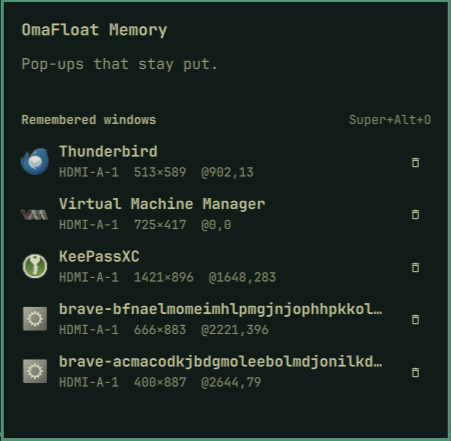

# OmaFloat

Omarchy plugin by **Agile Automation** — **pop-ups that stay put.**

Web3 wallet prompts, print dialogs, confirmation boxes, email compose windows,
and other pop-ups often open in awkward places. With OmaFloat you draw a box
once; next time that app opens, it returns to the same size and position —
without moving your other windows around.


Full-quality recording: [media/demo.mp4](media/demo.mp4)



> Like all Omarchy shell plugins, this runs **unsandboxed** inside `omarchy-shell`
> and can run `hyprctl` / shell snippets. Read the source before installing.

## Install

```bash
omarchy plugin add https://github.com/unipsycho/omarchy-omafloat.git --enable
```

Or drop this folder at `~/.config/omarchy/plugins/agileautomation.omafloat/`, then:

```bash
omarchy-shell shell rescanPlugins
omarchy plugin enable agileautomation.omafloat
```

The bar icon lands in the right section by default. Move it with:

```bash
omarchy bar move agileautomation.omafloat --section right
```

### Dependencies

Ships with Omarchy / expected on PATH: `slurp`, `jq`, `python3`, `hyprctl`.

## Capture hotkey

Merge [`bindings-snippet.lua`](bindings-snippet.lua) into `~/.config/hypr/bindings.lua`, then:

```bash
hyprctl reload
hyprctl configerrors
```

Default chord: **Super+Alt+O**

(`Super+O` remains pop-out & pin.)

1. Focus a window and press the hotkey
2. You’ll get a notification: “Draw a box for the float layout”
3. Left-drag a rectangle, then release — the window floats into that box and is saved

Press the hotkey again (or Escape in slurp) to cancel.

The bind runs the plugin script directly so capture still works if shell IPC is unavailable.

## Bar panel

Click the OmaFloat bar icon to open **Remembered windows**. Each row shows the
app icon, name (and window title when remembered), monitor, size, and position.
The delete icon forgets that entry.

## How restore works

Saved geometry lives in:

`~/.local/state/omarchy/omafloat/positions.json`

When a window opens, OmaFloat looks up a remembered layout for that app and —
if the live window is still in the same size class as the save — floats it back
to the remembered monitor-relative size and position.

Matching rules:

- Keys are `class::title` when captured (so different dialog *styles* can diverge).
- Changing subjects (wallet prompts, email titles) **reuse** a size-similar layout
  instead of creating a new entry.
- Restore prefers an exact title, then fuzzy title tokens among similar sizes,
  then the closest size-compatible sibling for that class.
- Windows larger than ~55% of the monitor are treated as **main** and never
  inherit a small pop-up layout.
- Pop-ups (≲40% of the monitor) get a looser size gate and a couple of delayed
  retries (including on `windowtitle`) so late-mapped dialogs still snap in.

## IPC

```bash
omarchy-shell agileautomation.omafloat capture
omarchy-shell agileautomation.omafloat commit
omarchy-shell agileautomation.omafloat cancel
omarchy-shell agileautomation.omafloat list
omarchy-shell agileautomation.omafloat status
omarchy-shell agileautomation.omafloat matchLog
omarchy-shell agileautomation.omafloat forget
omarchy-shell agileautomation.omafloat forgetKey org.kde.dolphin
```

`matchLog` (also included in `status`) is a short ring of recent restore
decisions: live class/title/size, popup role, why it restored or skipped, and
the remembered candidates considered (with reject reason / fuzzy score). Use it
to see why a pop-up did not snap — e.g. `main-skip`, `size`, `none-accepted`,
or which sibling would have been a better fuzzy match.
## Validate

```bash
omarchy plugin validate .
qmllint -I "$OMARCHY_PATH/shell" Service.qml BarWidget.qml Panel.qml
node tests/store-geometry-test.js
```

## Uninstall

```bash
omarchy plugin remove agileautomation.omafloat
rm -rf ~/.local/state/omarchy/omafloat
# remove the Super+Alt+O bind from ~/.config/hypr/bindings.lua
```

## License

MIT — see [LICENSE](LICENSE).
